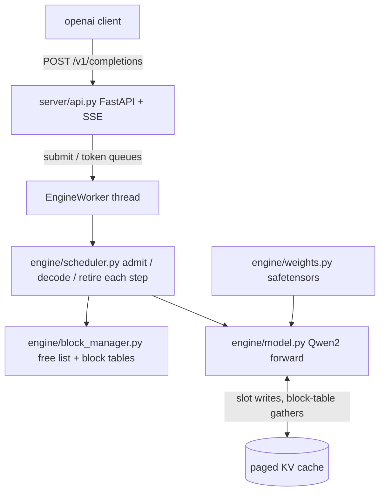

# mini-vllm

A small but real LLM inference engine, written from scratch in Python and PyTorch.

It serves [Qwen2.5-0.5B-Instruct](https://huggingface.co/Qwen/Qwen2.5-0.5B-Instruct)
behind an OpenAI-compatible HTTP API and implements the two ideas that make
[vLLM](https://github.com/vllm-project/vllm) fast: a **PagedAttention KV cache**
and a **continuous batching scheduler**. Everything in the serving path is
hand-written: the model forward pass, the weight loading, the cache, the
scheduler, the sampling, and the server. HuggingFace is used only for the
tokenizer, for downloading the checkpoint, and as a correctness oracle in tests.
`model.generate()` never appears in the engine.

```python
from openai import OpenAI

client = OpenAI(base_url="http://localhost:8000/v1", api_key="unused")
print(client.completions.create(
    model="Qwen/Qwen2.5-0.5B-Instruct",
    prompt="The capital of France is",
    max_tokens=16,
).choices[0].text)
```

## Background: how an LLM generates text

If you already know what a KV cache is, skip ahead.

A language model generates text one token at a time. Each step feeds the whole
sequence so far through the network and produces probabilities for the next
token. Inside every attention layer, each token computes a **key** and a
**value** vector; every new token attends over the keys and values of all
tokens before it.

Naively, generating token 500 means recomputing keys and values for tokens
1-499, even though they never change. The fix is the **KV cache**: store every
token's K and V the first time they are computed, and each new step only
computes the new token's K/V and reads the rest from cache. Generation then has
two phases:

- **Prefill**: run the whole prompt through the model once, filling the cache.
- **Decode**: one token per step, each step reading the entire cache.

The KV cache is the central data structure of an inference engine, and how you
manage its memory decides how many users you can serve at once.

## The three problems with naive serving

1. **KV cache memory waste.** A simple engine reserves one contiguous KV tensor
   per sequence, sized for the maximum possible length, because tensors cannot
   grow in place. Most sequences stop early, so most of that reservation is
   never used. The vLLM paper measured 60-80% of KV memory wasted this way. The
   GPU runs out of memory long before it runs out of compute.
2. **Static batching stalls.** Batch N requests together and the whole batch
   waits for the slowest sequence to finish before any new request starts. A
   short question stuck behind a long essay waits for the essay.
3. **`generate()` is a library call, not a server.** Real serving needs request
   admission, scheduling, preemption, streaming, and an API.

## Idea 1: PagedAttention

Manage KV memory the way an operating system manages RAM.

The cache is carved into fixed **blocks** of 16 tokens (page frames). Each
sequence keeps a **block table** (its page table) that maps logical token
positions to physical blocks. Token `i` of a sequence lives at physical slot:

```
table[i // 16] * 16 + i % 16
```

Consequences, same as in an OS:

- A sequence grows one block at a time, so worst-case waste is 15 slots in its
  last block, instead of an entire max-length reservation.
- Blocks return to the free pool the moment a sequence finishes, and any free
  block can serve any sequence, so the pool never fragments.
- Sequences are scattered across physical memory but see a contiguous logical
  view through their block table.

One more saving comes from the model itself: Qwen2.5 uses grouped-query
attention (GQA) with 2 KV heads shared by 14 query heads, so the cache stores
2 heads instead of 14. That alone makes it 7x smaller than a standard
multi-head cache.

In this repo: [engine/block_manager.py](engine/block_manager.py) is the
allocator (free list, block tables, leak and double-free guards), and
[engine/kv_cache.py](engine/kv_cache.py) owns the tensors. Cache writes are one
indexed scatter and cache reads are one gather over block tables; the comments
mark exactly where vLLM replaces each with a fused CUDA kernel.

## Idea 2: continuous batching

Re-decide who is in the batch on **every decode step**, instead of running a
fixed batch to completion.

Each scheduler step ([engine/scheduler.py](engine/scheduler.py)):

1. **Admit** waiting requests while blocks and batch slots allow. Each
   admission runs its prefill and emits that request's first token immediately.
2. **Decode** all running sequences together, one token each, in a single
   batched forward pass. Sequences of wildly different lengths batch fine
   because each one reads the cache through its own block table.
3. **Retire** finished sequences in the same step, freeing their blocks, so the
   next waiting request can join the very next step.

When the block pool runs dry, the scheduler **preempts** the youngest sequence:
frees its blocks and re-queues it, recomputing its context when capacity
returns. Youngest-first means the oldest request always makes progress, which
is the no-starvation guarantee. Greedy decoding makes recompute-on-resume land
on the identical continuation, and the tests prove it.

The result: a long request never blocks short ones, freed capacity is reused
within one step, and time-to-first-token stays flat as load grows.

## Architecture



Life of a request:

1. `POST /v1/completions` arrives; the prompt is tokenized and submitted to the
   engine worker, a dedicated thread that owns the scheduler (torch forward
   passes are synchronous and must not block the event loop).
2. The scheduler admits it, prefills its prompt into freshly allocated blocks,
   and emits the first token. Every following step decodes one more token in a
   batch with every other live request.
3. Tokens flow back to the HTTP handler through a per-request queue and stream
   out as `data: {...}` SSE chunks, ending with `data: [DONE]`. Non-streaming
   responses collect the same stream into one JSON body.
4. The request finishes by hitting its `max_tokens` or the EOS token; its
   blocks return to the pool that same step. If the client disconnects early,
   the server aborts the request and the blocks are freed immediately.

## How correctness is proven

Layered oracles, each one pinning the layer above it:

1. `reference_generate` ([engine/inference.py](engine/inference.py)) is a
   deliberately naive greedy decoder: full recompute every step, no cache. It
   is verified token-for-token against HF `generate(do_sample=False)` in fp32,
   plus a prefill logits comparison against the HF forward pass.
2. The paged cache path must reproduce `reference_generate` exactly: across
   block boundaries, in ragged batches, and after blocks are freed and reused
   (tiny random model for speed, real Qwen gated behind an env flag).
3. The scheduler must reproduce it under batching, late arrivals, preemption,
   and aborts, with the block pool provably returning to full every time.
4. The server must reproduce it through the official `openai` client, streaming
   and non-streaming, over a live uvicorn instance.

So "is the math right", "is the cache right", "is the scheduling right", and
"is the serving right" are separate questions with separate tests. The fast
suite (34 tests) uses a tiny random model and runs in seconds with no
downloads; the slow suite checks the real checkpoint against HF.

## Benchmark

Qwen2.5-0.5B-Instruct, fp16 on Apple MPS (8 GB machine). Workload per
concurrency level: 2x concurrency requests with uneven prompts and uneven
max_tokens (8-64), all submitted at t=0. The transformers baseline is the naive
serving pattern: fixed batches of size `concurrency` through `model.generate`,
where a request's latency is the time until its whole batch returns. Both
engines produce identical greedy tokens, so token counts match exactly.

| concurrency | engine | requests | wall (s) | output tokens | tokens/s | p50 TTFT (s) | p50 latency (s) | p99 latency (s) |
|---|---|---|---|---|---|---|---|---|
| 1 | mini-vllm | 2 | 3.3 | 94 | 28.5 | 1.2 | 2.7 | 4.4 |
| 1 | transformers | 2 | 4.3 | 94 | 21.7 | 3.8 | 3.8 | 5.3 |
| 8 | mini-vllm | 16 | 8.8 | 653 | 74.0 | 1.1 | 6.2 | 9.0 |
| 8 | transformers | 16 | 13.5 | 653 | 48.2 | 10.7 | 10.7 | 13.5 |
| 32 | mini-vllm | 64 | 10.2 | 2440 | 239.0 | 1.6 | 5.4 | 10.2 |
| 32 | transformers | 64 | 8.2 | 2440 | 297.2 | 6.7 | 6.7 | 8.2 |

Reading it honestly:

- **TTFT is the headline.** Per-step admission gets every request its first
  token in 1-2s regardless of load; static batching cannot stream from
  `generate` and holds requests behind whole batches (10.7s p50 TTFT at
  concurrency 8).
- **Concurrency 1 and 8:** mini-vllm wins throughput (+31% and +54%) and p50
  latency, because finished sequences retire mid-batch and freed slots backfill
  the same step instead of waiting for the batch to drain.
- **Concurrency 32** shows the cost of pure-PyTorch paging: HF's fused
  attention kernels push more tokens per step at wide batches, so it wins raw
  throughput (297 vs 239 tok/s) while still losing TTFT by 4x. Real vLLM pairs
  this same scheduler design with a fused PagedAttention CUDA kernel; the seams
  where that kernel slots in are marked in `engine/kv_cache.py`.

An optimization pass (one shared precomputed RoPE table instead of 24 per-step
recomputations, fused QKV projection) raised engine throughput 18-40% across
levels and cut the CPU parity suite from 93s to 52s; details in
[docs/decisions.md](docs/decisions.md).

## Getting started

```bash
git clone https://github.com/pavanbobba09/mini-vllm.git
cd mini-vllm
python3 -m venv .venv
.venv/bin/python -m pip install -e ".[server,dev]"

# fast tests: tiny random model, no downloads, a few seconds
.venv/bin/python -m pytest tests -q

# full parity vs HuggingFace (downloads Qwen2.5-0.5B-Instruct, slow on CPU)
MINI_VLLM_RUN_PARITY=1 MINI_VLLM_TEST_DEVICE=cpu MINI_VLLM_TEST_DTYPE=float32 \
  .venv/bin/python -m pytest tests -q

# start the server (first run downloads the model)
.venv/bin/python -m server.api --port 8000

# benchmark against transformers (writes bench/results.md)
.venv/bin/python -m bench.benchmark --concurrency 1 8 32
```

The engine picks CUDA, then Apple MPS, then CPU automatically; override with
`--device` and `--dtype` on the server and benchmark.

## Deploying

The repo ships a Dockerfile sized for free CPU hosting. Set the
`MINI_VLLM_API_KEY` environment variable to require an API key on `/v1/*`
(`GET /health` stays open for platform probes):

```bash
docker build -t mini-vllm .
docker run -e MINI_VLLM_API_KEY=sk-demo -p 7860:7860 mini-vllm
```

Step-by-step instructions for a free public deployment on Hugging Face Spaces
are in [docs/DEPLOY.md](docs/DEPLOY.md).

## Project structure

| path | what it does |
|---|---|
| `engine/config.py` | `ModelConfig` parsed from the HF `config.json`, `EngineConfig` serving knobs |
| `engine/model.py` | the model: embeddings, decoder stack, shared RoPE table, tied lm_head |
| `engine/layers.py` | RMSNorm, GQA attention (fused QKV, paged and non-paged paths), SwiGLU MLP |
| `engine/rope.py` | rotate_half rotary embeddings with precomputed cos/sin tables |
| `engine/weights.py` | safetensors loading and the explicit HF-to-ours weight remap |
| `engine/tokenizer.py` | thin HF tokenizer wrapper (encode/decode only) |
| `engine/inference.py` | `reference_generate` (the oracle) and paged prefill/decode steps |
| `engine/block_manager.py` | block allocator: free list, block tables, slot math |
| `engine/kv_cache.py` | paged K/V tensors: slot scatter writes, block-table gather reads |
| `engine/scheduler.py` | continuous batching: admit, batched decode, retire, preempt, abort |
| `server/api.py` | FastAPI `/v1/completions`: SSE streaming, sampling, disconnect handling |
| `bench/benchmark.py` | throughput/latency/TTFT comparison vs vanilla transformers |
| `tests/` | fast tiny-model suite plus slow HF-parity suite |
| `docs/decisions.md` | per-milestone design decisions and what changes at 10x scale |
| `docs/OVERVIEW.md` | build plan, milestone status, ground rules |

## Model facts worth knowing (Qwen2.5-0.5B-Instruct)

These are the details that break naive Llama-style reimplementations:

- 24 layers, hidden 896, 14 query heads, 2 KV heads (GQA), head_dim 64,
  vocab 151936, rope_theta 1e6, RMSNorm eps 1e-6.
- q/k/v projections have biases; o_proj does not.
- Tied embeddings: the checkpoint has no `lm_head.weight`; the output head
  reuses `embed_tokens.weight`.
- RoPE uses the HF rotate_half convention. The interleaved complex-pair
  variant produces subtly wrong tokens that look like a numerics bug.

## Known limitations

Deliberate scope cuts, documented in [docs/decisions.md](docs/decisions.md):

- Prefill is one prompt per forward pass; chunked/batched prefill is the
  biggest remaining throughput win at high concurrency.
- Attention is pure PyTorch (gather + masked softmax); a fused paged-attention
  kernel is what closes the wide-batch gap to vLLM.
- No prefix sharing / copy-on-write blocks, no logprobs, no stop strings, no
  chat template endpoint, no auth or rate limiting on the server.
