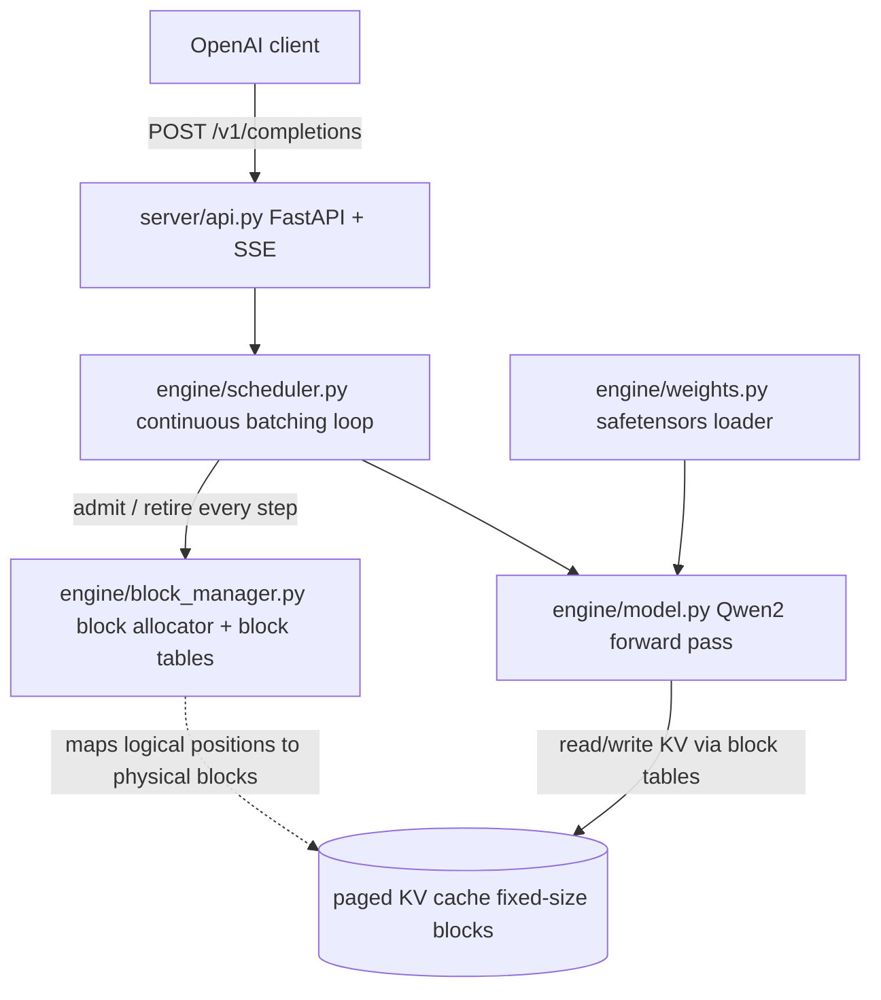

# mini-vllm: Project Overview

A minimal but real LLM inference engine in Python + PyTorch, built from scratch around the two ideas
that make vLLM fast: a PagedAttention KV cache and a continuous batching scheduler, exposed behind an
OpenAI-compatible HTTP API and benchmarked against vanilla `transformers`.

Target model: **Qwen2.5-0.5B-Instruct** (small enough to iterate fast and run correctness tests on CPU).

## The problem

Serving LLMs naively with `model.generate()` one request at a time fails in three ways:

1. **KV cache memory fragmentation.** Each sequence reserves a contiguous KV tensor sized for its
   maximum possible length. Most sequences finish early, so most of that memory is never used.
   vLLM measured 60-80% of KV memory wasted in naive systems. The GPU runs out of memory long
   before it runs out of compute.
2. **Static batching stalls.** Batch N requests together and the whole batch waits for the slowest
   sequence before any new request starts. Utilization collapses whenever lengths are uneven,
   which is always.
3. **No serving layer.** `generate()` is a library call. Real inference needs admission, scheduling,
   preemption, streaming, and an API.

## The solution, in one diagram



- **PagedAttention (M2):** the KV cache is split into fixed-size blocks (16 tokens each). A per-sequence
  block table maps logical token positions to physical blocks, exactly like OS virtual memory maps pages
  to frames. Sequences grow one block at a time and free their blocks the moment they finish, so memory
  waste is bounded by less than one block per sequence instead of a whole max-length reservation.
- **Continuous batching (M3):** the scheduler runs one decode step at a time for all active sequences.
  Every step it admits new requests, retires finished ones mid-batch, and frees their blocks. No request
  ever waits for an unrelated long sequence to finish.

## Repo layout

```
mini_llm/
  engine/
    config.py        # ModelConfig parsed from HF config.json, device/dtype resolution
    model.py         # MiniQwenForCausalLM: embeddings, decoder stack, tied lm_head
    layers.py        # RMSNorm, GQA attention, SwiGLU MLP, DecoderLayer
    rope.py          # rotate_half RoPE with precomputed cos/sin
    tokenizer.py     # thin HF tokenizer wrapper (encode/decode only)
    weights.py       # safetensors -> state dict, HF snapshot download
    inference.py     # M1 reference greedy decode (full recompute, the parity oracle)
    block_manager.py # M2 block allocator + block tables
    kv_cache.py      # M2 paged KV tensors + gather-based paged attention
    scheduler.py     # M3 continuous batching loop
  server/
    api.py           # M4 FastAPI /v1/completions, SSE streaming, sampling
  bench/
    benchmark.py     # M5 mini-vllm vs transformers at concurrency 1/8/32
  tests/
    test_tiny_forward.py    # fast: random tiny config, shapes and decode plumbing
    test_greedy_parity.py   # slow: token-for-token parity vs HF generate (M1 oracle)
    test_block_manager.py   # M2 allocator invariants
    test_scheduler.py       # M3 scheduler invariants
  docs/
    OVERVIEW.md      # this file
    decisions.md     # per-milestone design decisions
```

## Model facts that bite (Qwen2.5-0.5B-Instruct)

- 24 layers, hidden 896, 14 query heads, **2 KV heads (GQA)**, head_dim 64, intermediate 4864,
  vocab 151936, rope_theta 1e6, RMSNorm eps 1e-6.
- q/k/v projections **have biases**; o_proj does **not**. Llama clones with bias=False everywhere fail.
- **Tied embeddings:** no `lm_head.weight` in the checkpoint; the head reuses `embed_tokens.weight`.
- Pre-norm blocks, final RMSNorm before the head. SwiGLU MLP with three bias-free linears.
- GQA: each of the 2 KV heads serves 7 query heads (14 / 2). KV cache is 7x smaller than MHA.
- RoPE uses the HF rotate_half convention. The interleaved complex-pair style silently breaks parity.

## Milestone plan and status

| Milestone | What | Verified by | Status |
|---|---|---|---|
| M1 | Correct forward pass + greedy reference decode (full recompute) | prefill logits close to HF; 32-token greedy parity on 5 prompts, fp32 | **done** |
| M2 | PagedAttention KV cache: BlockManager, block tables, gather attention | allocator unit tests (no leak, no double-free, reuse); parity vs M1 reference | **done** |
| M3 | Continuous batching scheduler: per-step admit/retire, budget, preemption | invariant tests; long request does not block short ones | **done** |
| M4 | OpenAI-compatible server: /v1/completions, SSE, temperature/top_p | integration test with the official `openai` client | **done** |
| M5 | Benchmarks vs vanilla transformers at concurrency 1/8/32 | tokens/sec, p50/p99 latency table in README | **done** |

Rule: a milestone does not start until the previous one's tests are green.

## Ground rules

- Allowed: PyTorch, HF tokenizer (encode/decode only), safetensors loading, HF snapshot download.
- Banned in the core: `model.generate()`, transformers generation utils, vLLM, TGI. HF `generate()`
  appears only in tests (parity oracle) and the benchmark baseline.
- fp32 on CPU for all correctness tests (bf16 checkpoint upcast at load). bf16 only for GPU throughput.
- M1's full-recompute `reference_generate` is kept forever as the oracle for every later milestone:
  it separates "is the math right" from "is the cache right".
- Readable over clever. Every non-obvious line gets a short "why" comment.

## Key locked decisions (details in decisions.md)

1. Weight loading via explicit name handling, no fused QKV in v1 (noted as later optimization).
2. RoPE in the HF rotate_half convention with precomputed cos/sin tables.
3. M1 generation keeps zero caching on purpose; it is the correctness baseline.
4. Block size 16 tokens for the paged KV cache.
5. Preemption policy: preempt the youngest sequence, recompute on resume (swap-to-CPU noted as the alternative).

## How to run

```bash
# one-time setup
python3 -m venv --system-site-packages .venv
.venv/bin/python -m pip install -e ".[server,dev]"

# fast tests (tiny random model, no downloads)
.venv/bin/python -m pytest tests -q

# full parity tests (downloads Qwen2.5-0.5B-Instruct on first run)
MINI_VLLM_RUN_PARITY=1 MINI_VLLM_TEST_DEVICE=cpu MINI_VLLM_TEST_DTYPE=float32 \
  .venv/bin/python -m pytest tests -q

# server (M4)
.venv/bin/python -m server.api --port 8000

# benchmark (M5, writes bench/results.md)
.venv/bin/python -m bench.benchmark --concurrency 1 8 32
```
